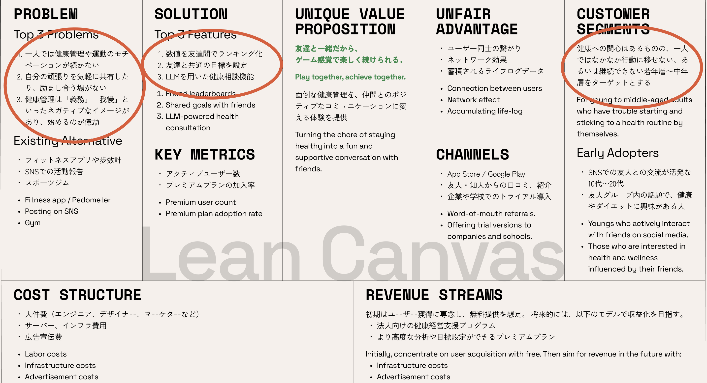
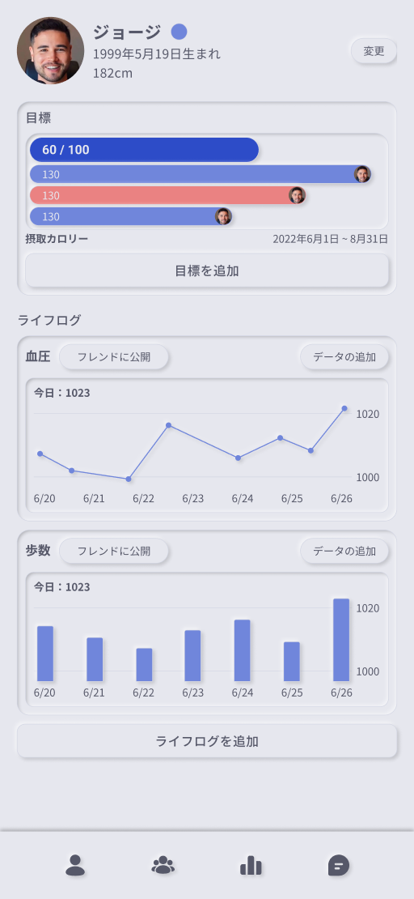
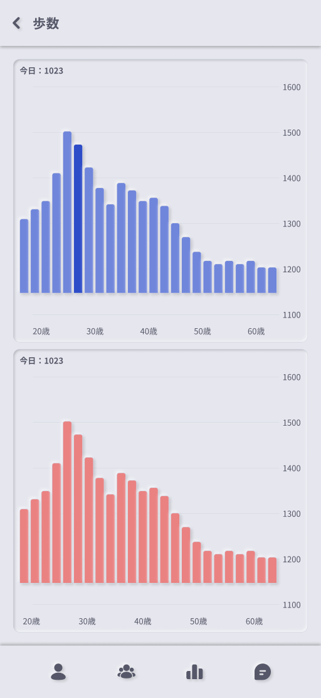
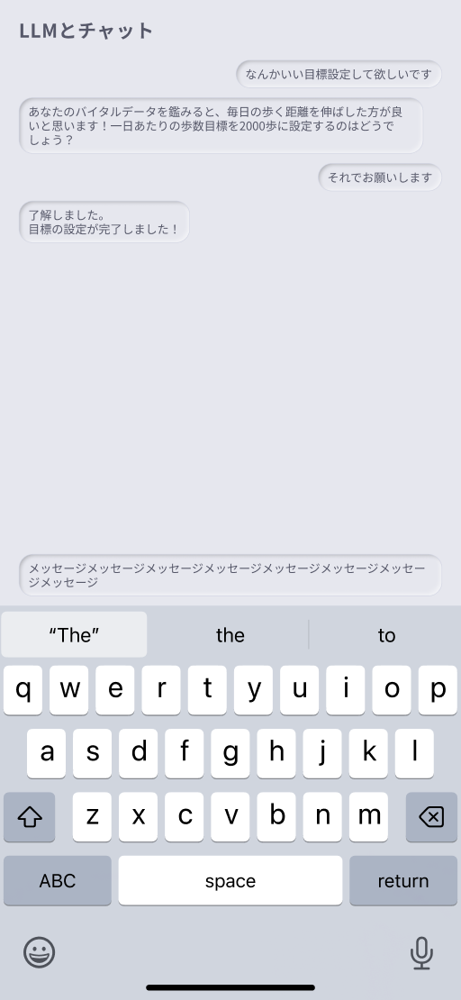

---

marp: true
math: mathjax
paginate: true
style: |
    :root {
        --alert-color: #D33;
    }

    section.cover {
        background: linear-gradient(
            var(--h1-color) 0%,
            var(--h1-color) 52%, /*タイトルの行数と大きさで変える*/
            white 0%,
            white 100%
        );
    }

    h1 { /* タイトル */
        color: white;
        font-size: 280%; /*タイトルの文字数で変える*/
    }

    h6 { /*日付など*/
        position: absolute;
        bottom: 25%;
    }

    h4 { /* 所属 */
        position: absolute;
        bottom: 15%;
    }

    h5 { /* 名前 */
        font-size: 120%;
        color: var(--h1-color);
        position: absolute;
        bottom: 10%;
    }

    header {
        font-size: 150%;
        font-weight: 600;
        color: white;
        background: var(--h1-color);
        width: 100%;
        padding: 0.5em 0.8em 0em;
        left: 0;
        top: 0;
        line-height: 76%;
    }

    h2 {
        color: white;
        font-size: 300%
    }

    h3 {
        color: var(--h1-color);
    }

    section.content {
        /* 中央寄せじゃなくて上寄せにしたければ外す
        justify-content: start;
        padding-top: 3em;
        */
    }
    

    blockquote > blockquote > blockquote {
        font-size: 75%;
        font-weight: 400;
        padding: 0;
        margin: 0;
        border: 0;
        border-top: 0.1em dashed #555;
        position: absolute;
        bottom: 40px;
        left: 70px;
        width: 1140px;
    }

    table {
        font-size: 75%;
        margin: 0 auto;
    }

    img[alt~="center"] {
        display: block;
        margin: 0 auto;
    }

    section::after {
        content: attr(data-marpit-pagination) " / " attr(data-marpit-pagination-total);
    }

    /* 2カラムレイアウト */
    .container {
    display: flex; 
    }

    .col {
    flex: 1;      
    /* padding: 10px; */
    }

    .col ul {
    padding-left: 20px; 
    margin-top: 0;
    }

    .col ul li ul {
    margin-bottom: 0.5em;
    }

    /* 画像*/
    .image-gallery-container {
    display: flex!important;
    flex-wrap: wrap;
    justify-content: space-around;
    align-items: flex-start;
    gap: 15px;
    padding: 10px;
    }

    .gallery-image {
    width: 256px;
    height: auto;
    object-fit: contain;
    max-height: 500px;
    }

---

<!--
_paginate: false
_class: cover
-->

# 4班 中間発表

#### 2025/7/1

##### 平田蓮、福村和真、中塚健太、兼田大輝、Zhang Yunong

---

<!--
_header: 解決したい課題社会問題 - Challenge to Solve
_class: content
-->

### 平均寿命と健康寿命の乖離

### Gap between Average Life Expectancy and Healthy Life Expectancy

- **問題**: 平均寿命と健康寿命が乖離していることで、医療・介護への過度な依存が発生、社会保障の持続可能性が課題
- **Problem**: The gap between average life expectancy and healthy life expectancy leads to excessive dependence on medical and nursing care, creating sustainability challenges for social security
- **解決策**: 健康管理アプリによって、若年層の健康への意識を向上
- **Solution**: Improve health awareness among young people through health management apps

---

<!--
_header: リーンキャンバス- Lean Canvas
_class: content
-->

---

<!--
_header: ユーザーの課題 - Challenge to Solve
_class: content
-->

- **課題1**: 健康管理はしたいが、何をしたらいいかわからない
- **Problem1**: Want to manage health but don't know what to do
- **提案価値**: 記録に基づいた、LLMによる提案
- **Solution**: LLM-based recommendations based on records

- **課題2**: 運動などを始めても、続かない
- **Problem**: Even when starting exercise, can't maintain it
- **提案価値**: 友達と繋がる機能で、モチベーションの向上
- **Solution**: Motivation improvement through social features with friends

---

<!--
_header: ユーザージャーニー - User Journey
_class: content
-->

1. **データを収集** - Data Collection
   - スマホやウェアラブルデバイスから自動で収集 - Automatic collection from smartphones and wearable devices
   - 追加情報を手で入力 - Manual input of additional information

2. **LLMに相談** - Consult with LLM
   - 蓄積されたデータを元に、LLMに健康相談 - Health consultation with LLM based on accumulated data

3. **目標の設定** - Goal Setting
   - 相談内容を元に、LLMが自動で設定 - Automatic goal setting by LLM based on consultation
   - 友達と共有し、一緒に目標を目指す - Share with friends and work together toward goals

---

<!--
_header: アプリ概要 - Overview
_class: content
-->

### バイタルデータを収集→統計の表示・データを踏まえたLLMとのチャット
### Vital data collection → Statistics display and LLM chat based on data

  
  
  

---

<!--
_header: システム構成 - System Architecture
_class: content
-->

### フロントエンド - Frontend
- **技術** - **Technology**
  - React
  - TypeScript
  - Expo

### バックエンド - Backend
- **技術** - **Technology**
  - Python
  - FastAPI
  - SQLite

---

<!--
_header: 機能概要 - Features
_class: content
-->

- **データの収集** - Data Collection
  - ヘルスケアアプリから自動収集 - Automatic collection from healthcare apps
  - 手動で追加 - Manual addition

- **目標の設定** - Goal Setting
  - 手動で設定 - Manual setting
  - LLMを用いて自動で設定 - Automatic setting using LLM
  
- **統計情報の表示** - Statistics Display
  - 自分、友達、全ユーザーのデータ - Personal, friends' and all users' data

- **LLMとのチャット** - LLM Chat
  - 蓄積されたデータを自動で組み込んでRAG - RAG with automatically incorporated accumulated data

---

<!--
_header: 現在の進捗 - Current Progress
_class: content
-->

### フロントエンド - Frontend

- 画面遷移とコンポーネント構造の設計完了 - Screen transitions and component structure design completed
- UI設計の完了 - UI design completed
- 基本UIの実装中 - Basic UI implementation in progress

### バックエンド - Backend

- データベース設計・実装完了 - Database design and implementation completed
- API設計進行中 - API design in progress
- LLMの技術検証進行中 - LLM technical verification in progress

---

<!--
_header: 今後の予定 - Future Plans
_class: content
-->

### フロントエンド

- ~7/8: モックデータを用いた表示機能の完成 - Complete display functionality using mock data
- ~7/22: ビジュアルデザインの反映 - Apply visual design
- ~7/29: バックとの統合、デモの検証 - Backend integration and demo verification

### バックエンド

- ~7/8: APIの設計 - API design
- ~7/15: LLMの技術検証 - LLM technical verification
- ~7/22: APIの実装 - API implementation
- ~7/29: フロントとの統合、デモの検証 - Frontend integration and demo verification

---

<!--
_header: 各メンバーの役割 - Roles of Members
_class: content
-->

| メンバー | マネジメント | UX設計・要件定義 | UI設計 | バックエンド | 技術検証 | フロントエンド |
| --- | :---: | :---: | :---: | :---: | :---: | :---: |
| Member | Management | UX Design/RD | UI Design | Backend | PoC | Frontend |
| 平田 | ○ | ○ | ○ | ○ |   | ○ |
| 福村 |   | ○ |   | ○ | ○ |   |
| 中塚 |   | ○ |   |   |   | ○ |
| 兼田 |   | ○ |   | ○ |   |   |
| Zhang | | ○ |   |   |   | ○ |
